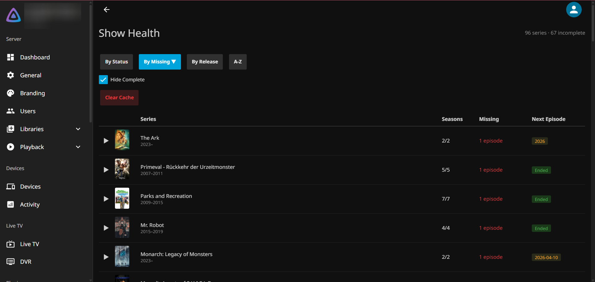

# Show Health

Jellyfin plugin that checks your TV series library for completeness. It compares your local episodes and seasons against IMDb data and shows you what's missing.



## Features

- Missing episodes and seasons per series
- Series status: upcoming release dates, TBA, or Ended
- Sort by status, missing count, release date, or name
- Hide complete series to focus on what's missing
- Click any missing item to copy its name (e.g. `Breaking Bad S02E03`)
- Smart caching: ended series cached for 1 year, running series for 7 days, auto-invalidates near release dates
- Scheduled scan with activity log notifications (only notifies about NEW missing content)

## Installation

1. In Jellyfin, go to **Dashboard > Plugins > Repositories**
2. Add a new repository:
   - **Name:** `Show Health`
   - **URL:** `https://raw.githubusercontent.com/IsntFunny/jellyfin-show-health/main/manifest.json`
3. Go to **Catalog**, find **Show Health**, and install it
4. Restart Jellyfin

## Manual Installation

1. Download the latest release from [GitHub Releases](https://github.com/IsntFunny/jellyfin-show-health/releases)
2. Extract the ZIP into your Jellyfin plugins folder (e.g. `/config/plugins/Jellyfin.Plugin.ShowHealth/`)
3. Restart Jellyfin

## Usage

After installation, **Show Health** appears in the main menu. The dashboard loads your series list instantly, then analyzes each series against IMDb one by one.

The scheduled task **Show Health Scan** runs every 24 hours and logs new missing content to the Jellyfin activity log.

## Build

```bash
dotnet build Jellyfin.Plugin.ShowHealth.sln
```

## License

[GPLv3](LICENSE)
